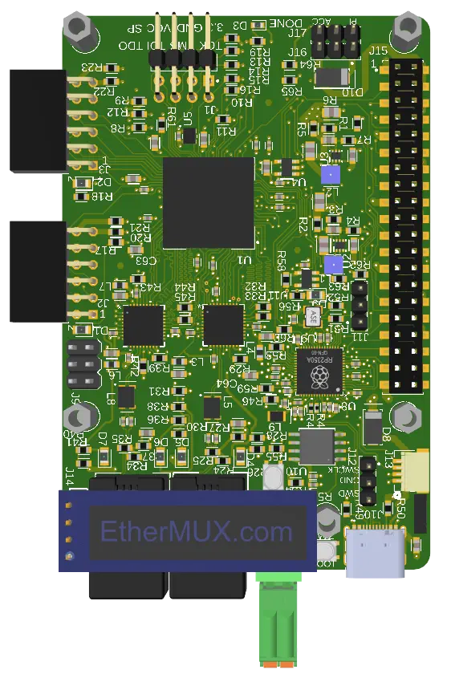

# EtherMux HUB

## Board: B2601-R01
### STATUS: Under Construction  
The board is in the testing phase.  Refer to [testing.md](./testing.md) for more details.  

## Description

The EtherMux Hub is a 100Mbps Single Pair Ethernet (SPE) board. It is the main board used to implement the open source EtherMux protocol.  It contains 2 DP83TC812 SPE phys which allow for a daisy chain network configuration.  The board size is in a raspberry pi form factor and is HAT+ compatible.  It has a connector for an SSD1306 compatible OLED display.  It is powered by a Raspberry PI 2350 microcontroller with 16MB of flash.  A low latency mac is implemented on an FPGA for ultimate performance.

The **EtherMux Hub** is a **100 Mb/s Single Pair Ethernet (SPE)** platform serving as the primary hardware implementation of the open‑source **EtherMux** protocol. The design incorporates **two TI DP83TC812 SPE PHYs** , enabling deterministic **daisy‑chain network topologies** over SPE links.

A **low‑latency MAC** is implemented in an **FPGA** , providing deterministic timing and high‑performance packet handling for demanding real‑time applications.

The board follows the **Raspberry Pi form factor** and is fully **HAT+ compliant** , ensuring mechanical and electrical compatibility with the broader ecosystem. An onboard header supports an **SSD1306‑compatible OLED display** for runtime diagnostics and system status.

Control and protocol execution are handled by a **Raspberry Pi RP2350 microcontroller** , paired with **16 MB of external flash** , providing ample capacity for firmware, protocol stacks, and application‑level features.
## Software
The Ethermux code resides in the EtherMux repository [/logixell/Ethermux](https://github.com/Logixell/EtherMux/tree/main)  
This includes the Software that runs on the RP2350 microcontroller as well as the FPGA configuration binarys.  Documentation and FPGA datasheet will also reside there.

## Design files
The full design is available in the release section.  The release section includes all binary files required to reproduce this board including a Fusion360 project file, Step file, Gerbers, BOM etc.

## Ordering
At the time of writing, this board is not available through any commercial distributors. You will need to have it fabricated and assembled yourself. The design is optimized for JLCPCB’s manufacturing capabilities and component library.
JLCPCB’s minimum PCB order quantity is typically five units, with per‑unit cost decreasing at higher volumes. All fabrication files (Gerbers, drill data, CPL, and BOM) are provided in the project’s Releases section.  More information is available on [Release-R01.md](./Release-R01.md)
Before ordering, review [testing.md](./testing.md) to understand the current feature set and known limitations.
The assembly BOM includes only SMT components. All connectors are intended to be hand‑soldered. Multiple connector footprints are provided to support different configurations; not all will be required for every build, allowing maximum flexibility.

