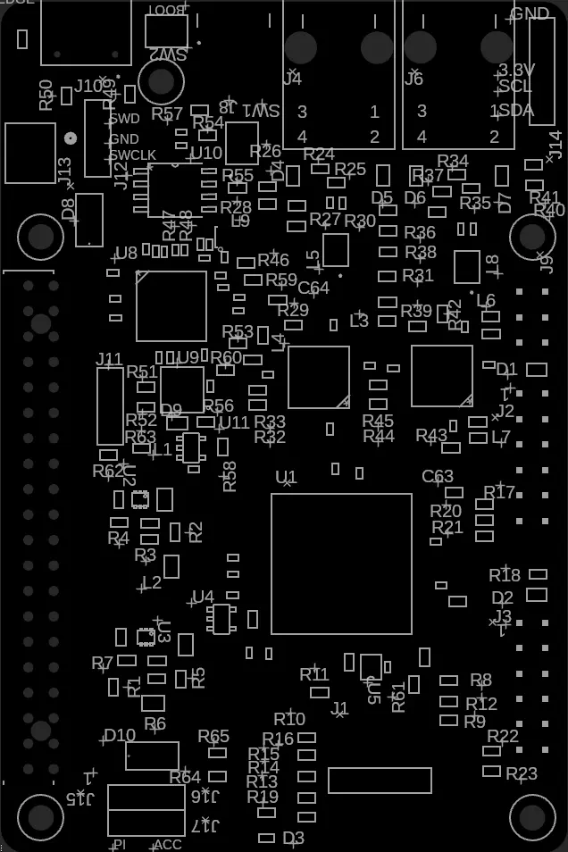

# EtherMux Hub Testing

## Board: B2601-R01 SN004

## Status: 🚧 In progress

### Overview

B2601-R01 is the first proto board assembled by JLCPCB.com  I am currently testing the boad as well as developing features.  My progress will be updated here periodically.

### Milestones

**[✔️] RP2350 Boot:**  On initial boot the board will enumerate as a hard drive.  Upon pasting a .uf2 file into the drive the board will automatically reboot and start running the program.  Using terra term we can see the boot progress and command prompt (connected via USB port).  The board will run automatically after a power cycle.  If the boot button is depressed during power up the board will go back to enumerating as a hard drive.

**[✔️] OLED display:** Attached I2C Blue OLED LCD Display Module SSD1306 to J14.  Software has detected it and it is functional.

**[✔️] RP2350 Debug Port:** Running on VS Code
Pico Probe using -Cortex Debug:
**J12**
pin3 SWD Blue or Yellow
Pin2 GND Black
Pin1 SWCLK Green or Orange

**[✔️] FPGA Debug Port:** J1 connected to HW-USBN-2A Lattice Diamond Software V3.14.0.75.2.  Note: Prog pin must be set to
high Z on RP2350.  Done...
Note: Use 3.3V pin for programmer VCC.

**[] : FPGA SPI Interface**

**[] : PHY MDIO Communication**

**[] : PHY Link**

### Design Verification

Supply testing:
5V USB: 4.93
VSYS:  4.64V
3.3V:  3.29V
2.5v:  2.48V
1.1V:  1.08V

## Deficiencies

**Boot SW2**
The RP2350 ref design used an internal pullup which I thought may be a little weak so I added an external 10K pullup.  It seems as though this pin becomes an active pullup after boot so the pullup is not really unnecessary, but other than using a bit more power it is not an issue.

**Done LED**
The design intent was for the done led to turn on immediately at power on to give a visual indication of power to the board and also provide a visual indication of FPGA configuration failure if it remains on.  This is why a red led was chosen.  However the done pin should have been connected to the cathode of D3.  So for now the red Done led will remain lit after the FPGA has been programmed.  Annoying but ok...

**RP2350A Bug**
The RP2350A has en errata which causes the .UF2 file to not load when using Klipper.  Use the newer RP2350A-A4 (JLCPCB C9900206085) in the future.  Due to klipper's complexities I have decided to keep it on a separate RP2040 Hat anyways, so this should not be an issue.